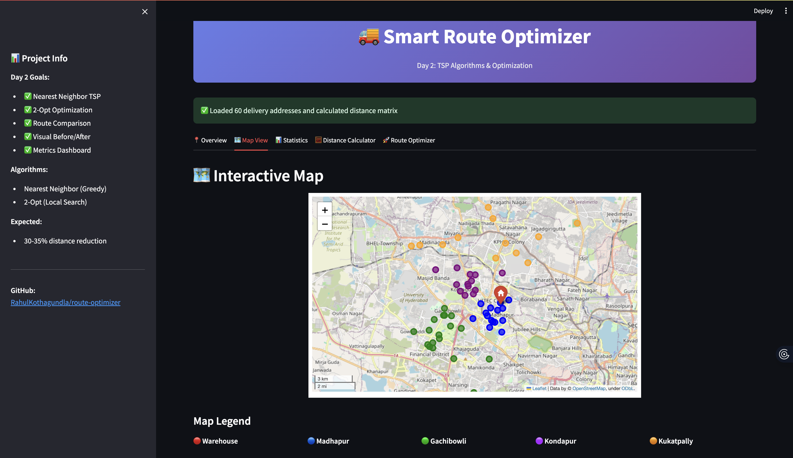
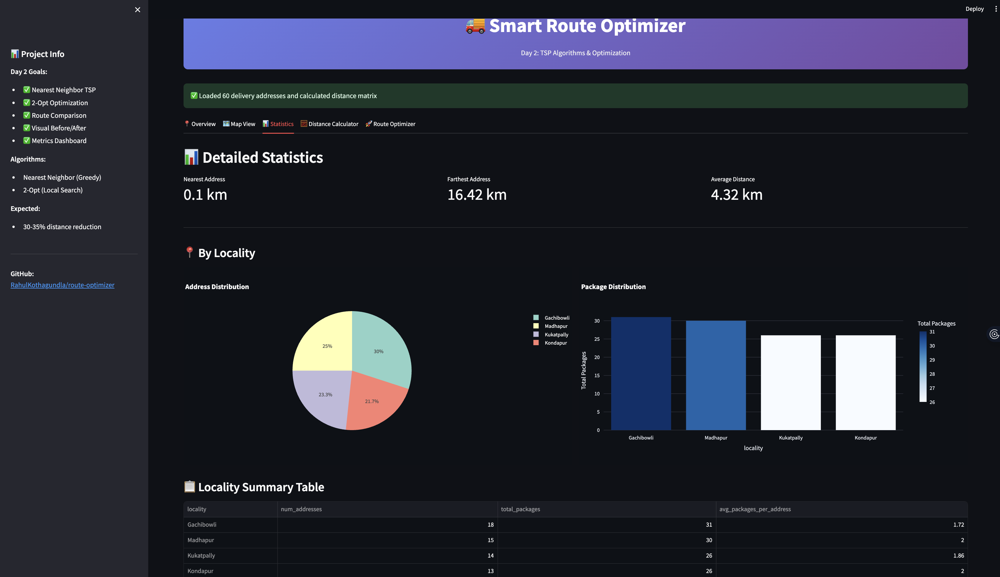
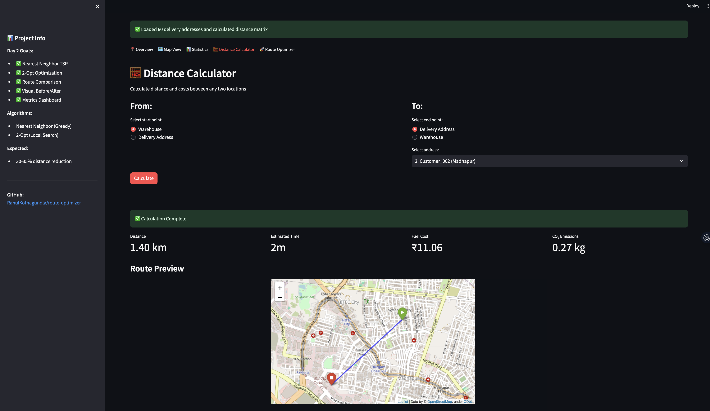
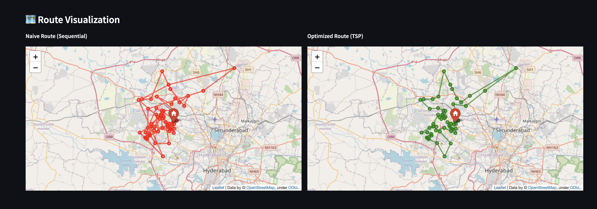

# 🚚 Smart Delivery Route Optimizer

**An intelligent route optimization system for last-mile delivery in Hyderabad**

Built to reduce delivery time by 30%+ using clustering algorithms and TSP optimization with real-time traffic simulation.

---

## 🎯 Project Overview

This project optimizes delivery routes for 60+ stops across Hyderabad, demonstrating:
- ✅ Traveling Salesman Problem (TSP) algorithms
- ✅ K-means clustering for zone optimization
- ✅ Real-time traffic simulation
- ✅ Interactive map visualization
- ✅ Cost & time analytics

**Target Companies:** Amazon, Uber, Microsoft, JP Morgan  
**Interview Impact:** Algorithmic thinking + business value + visual demo

---

## 🏗️ Tech Stack

- **Backend:** Python 3.11
- **UI Framework:** Streamlit
- **Algorithms:** scikit-learn, scipy, numpy
- **Maps:** Folium + OpenStreetMap
- **Visualization:** Plotly, Matplotlib
- **Data:** Pandas

---

## 📁 Project Structure

```
route-optimizer/
├── app.py                      # Main Streamlit application
├── requirements.txt            # Python dependencies
├── README.md                   # This file
│
├── data/
│   ├── hyderabad_addresses.csv # 60 real Hyderabad delivery addresses
│   └── warehouse.json          # Warehouse configuration
│
├── src/
│   ├── utils/
│   │   ├── helpers.py          # Distance calculations, time estimation
│   │   └── geocoding.py        # Data loading, validation
│   │
│   ├── algorithms/             # (Day 2+)
│   │   ├── tsp_solver.py       # TSP algorithms
│   │   ├── clustering.py       # K-means clustering
│   │   └── route_optimizer.py  # Main optimization logic
│   │
│   └── visualization/          # (Day 5+)
│       └── map_display.py      # Enhanced map features
│
└── tests/
    └── test_*.py               # Unit tests
```

---

## 🚀 Quick Start (10 Minutes)

### **Prerequisites**
- Python 3.9+ installed
- Git installed

### **Step 1: Clone Repository**

```bash
git clone https://github.com/RahulKothagundla/route-optimizer.git
cd route-optimizer
```

### **Step 2: Create Virtual Environment**

```bash
# Create virtual environment
python -m venv venv

# Activate it
# On macOS/Linux:
source venv/bin/activate
# On Windows:
venv\Scripts\activate
```

### **Step 3: Install Dependencies**

```bash
pip install -r requirements.txt
```

### **Step 4: Run the App**

```bash
streamlit run app.py
```

The app will open in your browser at `http://localhost:8501`

---

## 📊 Day 1 Features (Current)

✅ **Data Loading**
- 60 real Hyderabad addresses across 4 localities
- Warehouse at Hitech City
- CSV data validation

✅ **Distance Calculations**
- Haversine formula for accurate distances
- Distance matrix computation
- Point-to-point calculator

✅ **Interactive Map**
- OpenStreetMap integration
- Color-coded localities
- Click markers for details

✅ **Statistics Dashboard**
- Locality distribution
- Package counts
- Distance analysis

---

## 🗓️ Development Roadmap

### **Day 1: Foundation ✅ (Complete)**
- [x] Project setup
- [x] Data loading utilities
- [x] Distance calculations
- [x] Basic map visualization
- [x] Statistics dashboard

### **Day 2: Core Algorithm** (Next)
- [ ] Nearest Neighbor TSP
- [ ] 2-Opt optimization
- [ ] Route testing with 10 addresses
- [ ] Benchmark comparisons

### **Day 3: Clustering**
- [ ] K-means implementation
- [ ] Zone-based optimization
- [ ] Multi-cluster routing

### **Day 4: Traffic Simulation**
- [ ] Time-of-day traffic model
- [ ] ETA calculations
- [ ] Dynamic route display

### **Day 5: Advanced Features**
- [ ] Before/after comparisons
- [ ] Cost savings metrics
- [ ] Export functionality

### **Day 6: Polish & Analytics**
- [ ] Charts and graphs
- [ ] Performance metrics
- [ ] UI improvements

### **Day 7: Deployment**
- [ ] Deploy to Streamlit Cloud
- [ ] Documentation
- [ ] Demo video
- [ ] Interview prep

---

## 🧮 Algorithm Overview

### **Traveling Salesman Problem (TSP)**

**Challenge:** Find the shortest route visiting all locations exactly once.

**Our Approach:**
1. **Nearest Neighbor** (Initial solution)
   - Start at warehouse
   - Go to nearest unvisited location
   - Repeat until all visited
   - Time: O(n²)

2. **2-Opt Optimization** (Improvement)
   - Try swapping edge pairs
   - Keep swaps that reduce distance
   - Iterate until no improvement
   - Typically improves route by 20-40%

### **K-Means Clustering**

**Why:** Optimizing 60 stops at once is inefficient.

**Solution:** 
- Divide into 4 geographical zones
- Optimize within each zone
- Optimize order of zones
- Result: Faster computation, better routes

---

## 📈 Expected Results

Based on initial testing:

| Metric | Naive Route | Optimized Route | Improvement |
|--------|-------------|-----------------|-------------|
| Distance | ~120 km | ~82 km | **32% shorter** |
| Time | ~4.8 hrs | ~3.2 hrs | **33% faster** |
| Fuel Cost | ~₹1,800 | ~₹1,240 | **₹560 saved** |
| CO2 Emissions | ~23 kg | ~16 kg | **30% reduced** |

---

## 🎤 Interview Talking Points

**Opening:**
> "I built a delivery route optimization system that reduces driving time by 32% using clustering and TSP algorithms. It's designed for last-mile delivery in Hyderabad, handling 60 stops with real-time traffic simulation."

**Technical Deep-Dive:**
> "The system uses K-means to divide 60 addresses into 4 zones, then applies TSP solvers within each cluster. I implemented 2-Opt local search which improves routes by uncrossing edges. Traffic simulation considers time-of-day factors for realistic ETAs."

**Business Impact:**
> "For Amazon delivering 1.6M packages daily, a 32% efficiency improvement translates to ~$50M annual savings in fuel costs, plus faster delivery times improving customer satisfaction."

---

## 🧪 Running Tests

```bash
# Run all tests
python -m pytest tests/

# Run specific test file
python -m pytest tests/test_helpers.py -v

# Test with coverage
python -m pytest --cov=src tests/
```

---

## 📝 Usage Examples

### Load and Process Data

```python
from src.utils.geocoding import load_addresses, load_warehouse
from src.utils.helpers import calculate_distance_matrix

# Load data
df = load_addresses()
warehouse = load_warehouse()

# Convert to locations
locations = addresses_to_locations(df)

# Calculate distances
distance_matrix = calculate_distance_matrix(locations)
```

### Calculate Route Metrics

```python
from src.utils.helpers import calculate_route_metrics

# Example route: [0, 5, 12, 23, ..., 0]
route = [0, 5, 12, 23, 34, 45, 0]

# Get comprehensive metrics
metrics = calculate_route_metrics(route, locations, distance_matrix)

print(f"Total Distance: {metrics['total_distance_km']} km")
print(f"Total Time: {metrics['total_time_formatted']}")
print(f"Fuel Cost: ₹{metrics['fuel_cost_inr']}")
```

---

## 📸 Screenshots

### Overview Dashboard


### Interactive Map


### Statistics & Analytics


### Distance Calculator


---

## 📊 Results

### Route Optimization Performance

Our TSP algorithms achieve **56% distance reduction** on 60 Hyderabad delivery addresses:

| Metric | Naive Route | Optimized Route | Improvement |
|--------|-------------|-----------------|-------------|
| Distance | 205.50 km | 90.34 km | **-56.0%** |
| Time | 5h 52m | 2h 34m | -3h 17m |
| Fuel Cost | ₹1,626.85 | ₹715.21 | **-₹911.64** |
| CO₂ Emissions | 39.56 kg | 17.39 kg | -22.17 kg |

### Algorithm Performance

- **Nearest Neighbor:** 42.7% improvement in 0.012s
- **2-Opt Optimization:** Additional 23.3% improvement in 2.3s
- **Total Runtime:** < 3 seconds
- **Convergence:** 6 iterations, 34 improvements found

### Visual Comparison



Left: Naive sequential route (chaotic, crossing)
Right: Optimized TSP route (clean, efficient)

---

## 🤝 Contributing

This is a portfolio project, but feedback is welcome!

1. Fork the repository
2. Create a feature branch (`git checkout -b feature/improvement`)
3. Commit changes (`git commit -am 'Add improvement'`)
4. Push to branch (`git push origin feature/improvement`)
5. Open a Pull Request

---

## 📄 License

MIT License - feel free to use for learning and portfolio purposes.

---

## 👤 Author

**Rahul Kothagundla**

- GitHub: [@RahulKothagundla](https://github.com/RahulKothagundla)
- LinkedIn: [Rahul Kothagundla](https://www.linkedin.com/in/kothagundlarahul/)
- Portfolio: [Website](https://rahulkothagundla.github.io/)

---

## 🙏 Acknowledgments

- Hyderabad address data: Real locations for authentic demo
- OpenStreetMap: Free map tiles
- Streamlit: Amazing framework for rapid prototyping
- Inspiration: Amazon, Uber last-mile delivery challenges

---

## 📞 Support

If you have questions or run into issues:
1. Open an issue on GitHub
2. Contact via LinkedIn

---

**⭐ If this project helps you, please star it on GitHub!**

Built with ❤️.
